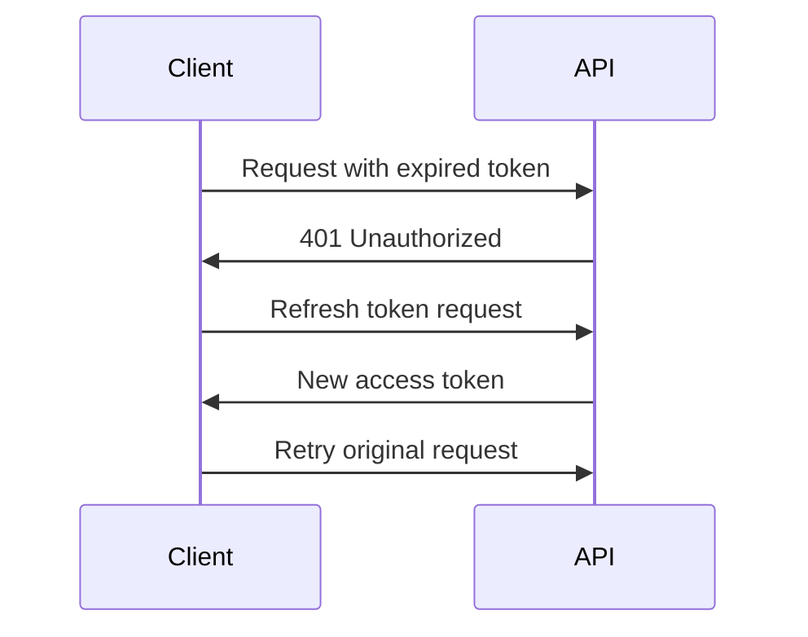

# JuaJobs API Authentication Design

## Overview
This document outlines the authentication mechanisms and security requirements for the JuaJobs API, specifically designed for the African market context.

## Authentication Methods

### 1. Primary Authentication Methods

#### OAuth 2.0 with PKCE
- Implementation of OAuth 2.0 with Proof Key for Code Exchange (PKCE)
- Supports both mobile and web clients
- Flow:
  1. Client generates code verifier and challenge
  2. Authorization request with PKCE challenge
  3. Token exchange with code verifier
  4. Access token issuance

#### JWT-based Authentication
- Stateless authentication using JSON Web Tokens
- Token structure:
  ```json
  {
    "header": {
      "alg": "RS256",
      "typ": "JWT"
    },
    "payload": {
      "sub": "user_id",
      "roles": ["job_seeker", "employer"],
      "permissions": ["read:jobs", "write:applications"],
      "iat": 1516239022,
      "exp": 1516242622
    }
  }
  ```

### 2. Mobile-Specific Considerations

#### Offline Authentication
- Support for offline authentication using cached credentials
- Secure storage of refresh tokens
- Automatic token refresh when connectivity is restored

#### Biometric Authentication
- Optional biometric authentication for mobile apps
- Secure storage of biometric data
- Fallback to PIN/password authentication

## Token Management

### Access Tokens
- Short-lived (15 minutes)
- Signed using RS256
- Contains minimal necessary claims
- Stored in memory only

### Refresh Tokens
- Long-lived (30 days)
- Stored securely in encrypted storage
- Rotating refresh token mechanism
- Automatic revocation on security events

### Token Refresh Strategy


## Security Requirements for API Consumers

### 1. Client Requirements
- Implement proper token storage
- Support token refresh mechanism
- Handle offline scenarios
- Implement proper error handling
- Support certificate pinning

### 2. API Key Management
- Unique API key per client
- Rate limiting based on API key
- Regular key rotation
- Monitoring for suspicious activity

### 3. Transport Security
- TLS 1.2+ required
- Certificate validation
- HSTS implementation
- CORS configuration

## Implementation Guidelines

### 1. Mobile Clients
```kotlin
// Example Android implementation
class AuthManager {
    private val secureStorage: SecureStorage
    
    fun authenticate(username: String, password: String): AuthResult {
        // Implement authentication logic
    }
    
    fun refreshToken(): TokenResult {
        // Implement token refresh
    }
}
```

### 2. Web Clients
```javascript
// Example web implementation
class AuthService {
    async login(credentials) {
        // Implement login logic
    }
    
    async refreshToken() {
        // Implement token refresh
    }
}
```

## Security Best Practices

1. Never store access tokens in persistent storage
2. Implement proper token revocation
3. Use secure communication channels
4. Implement proper error handling
5. Regular security audits
6. Monitor for suspicious activities

## Error Handling

### Authentication Errors
```json
{
    "error": "invalid_token",
    "error_description": "The access token has expired",
    "error_code": "AUTH_001"
}
```

### Rate Limiting
```json
{
    "error": "rate_limit_exceeded",
    "error_description": "Too many requests",
    "retry_after": 60
}
```

## Monitoring and Logging

1. Authentication attempts
2. Token usage
3. Failed attempts
4. Suspicious activities
5. Rate limit hits

## Compliance Requirements

1. GDPR compliance for EU users
2. Local data protection laws
3. Industry-specific regulations
4. Regular security audits
5. Incident response procedures 