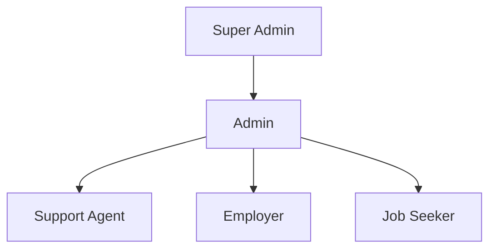

# JuaJobs API Authorization Framework

## Overview
This document outlines the authorization framework for the JuaJobs API, detailing role-based access control, permission mapping, and resource ownership models.

## Role-Based Access Control (RBAC)

### Core Roles

1. **Job Seeker**
   - Basic profile management
   - Job search and application
   - Resume management
   - Application tracking

2. **Employer**
   - Company profile management
   - Job posting and management
   - Candidate screening
   - Interview scheduling

3. **Admin**
   - System configuration
   - User management
   - Content moderation
   - Analytics access

4. **Support Agent**
   - User support
   - Issue resolution
   - Basic moderation
   - Ticket management

### Role Hierarchy


## Permission Mapping

### Resource-Based Permissions

```json
{
  "jobs": {
    "create": ["employer"],
    "read": ["job_seeker", "employer", "admin"],
    "update": ["employer", "admin"],
    "delete": ["employer", "admin"]
  },
  "applications": {
    "create": ["job_seeker"],
    "read": ["job_seeker", "employer", "admin"],
    "update": ["employer", "admin"],
    "delete": ["admin"]
  }
}
```

### API Operation Permissions

| Endpoint | Method | Required Permissions |
|----------|---------|---------------------|
| `/jobs` | POST | `jobs:create` |
| `/jobs/{id}` | GET | `jobs:read` |
| `/jobs/{id}` | PUT | `jobs:update` |
| `/jobs/{id}` | DELETE | `jobs:delete` |
| `/applications` | POST | `applications:create` |
| `/applications/{id}` | GET | `applications:read` |

## Resource Ownership Model

### 1. Direct Ownership
- Users own their profiles
- Employers own their company profiles
- Job seekers own their applications

### 2. Delegated Ownership
- Company admins can manage company profiles
- Team leads can manage team members
- Support agents can manage user issues

### 3. Shared Ownership
- Job postings (employer + admin)
- Applications (job seeker + employer)
- Reviews (both parties)

## Permission Delegation

### 1. Company-Level Delegation
```json
{
  "company_id": "123",
  "delegated_permissions": {
    "user_id": "456",
    "permissions": ["jobs:create", "jobs:update"],
    "scope": "company",
    "expires_at": "2024-12-31T23:59:59Z"
  }
}
```

### 2. Team-Level Delegation
```json
{
  "team_id": "789",
  "delegated_permissions": {
    "user_id": "101",
    "permissions": ["applications:read", "applications:update"],
    "scope": "team",
    "expires_at": "2024-12-31T23:59:59Z"
  }
}
```

## Implementation Guidelines

### 1. Permission Checking
```typescript
interface Permission {
  resource: string;
  action: string;
  conditions?: Record<string, any>;
}

class AuthorizationService {
  async checkPermission(
    user: User,
    permission: Permission
  ): Promise<boolean> {
    // Implement permission checking logic
  }
}
```

### 2. Role Management
```typescript
interface Role {
  name: string;
  permissions: Permission[];
  inherits?: string[];
}

class RoleService {
  async assignRole(
    user: User,
    role: Role
  ): Promise<void> {
    // Implement role assignment logic
  }
}
```

## Security Considerations

### 1. Permission Escalation Prevention
- Validate permission inheritance
- Check for circular dependencies
- Implement permission boundaries

### 2. Audit Logging
- Log all permission changes
- Track role assignments
- Monitor permission usage

### 3. Regular Reviews
- Periodic permission audits
- Role effectiveness assessment
- Security compliance checks

## Error Handling

### Permission Denied
```json
{
  "error": "permission_denied",
  "error_description": "User does not have required permissions",
  "required_permissions": ["jobs:create"],
  "error_code": "AUTH_002"
}
```

### Invalid Role Assignment
```json
{
  "error": "invalid_role_assignment",
  "error_description": "Cannot assign role due to permission boundaries",
  "error_code": "AUTH_003"
}
```

## Best Practices

1. Follow principle of least privilege
2. Regular permission audits
3. Clear documentation of roles and permissions
4. Proper error handling
5. Comprehensive logging
6. Regular security reviews