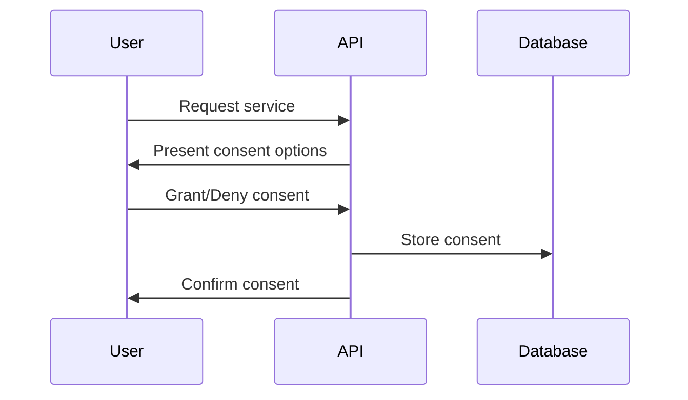

# JuaJobs API Data Privacy & Compliance

## Overview
This document outlines the data privacy and compliance requirements for the JuaJobs API, focusing on PII handling, consent management, and regional compliance requirements.

## Personally Identifiable Information (PII) Handling

### 1. PII Classification

#### High Sensitivity
- Full name
- National ID numbers
- Bank account details
- Biometric data
- Health information

#### Medium Sensitivity
- Email addresses
- Phone numbers
- Physical addresses
- Employment history
- Educational background

#### Low Sensitivity
- Job preferences
- Skills
- Public profile information
- Application status

### 2. Data Storage Requirements

#### Encryption Standards
```json
{
  "at_rest": {
    "algorithm": "AES-256-GCM",
    "key_rotation": "90 days",
    "backup_encryption": true
  },
  "in_transit": {
    "protocol": "TLS 1.3",
    "certificate_requirements": "SHA-256",
    "key_exchange": "ECDHE"
  }
}
```

#### Data Retention Policies
```json
{
  "user_profiles": {
    "active": "indefinite",
    "inactive": "2 years",
    "deleted": "30 days"
  },
  "applications": {
    "active": "1 year",
    "archived": "5 years",
    "deleted": "30 days"
  },
  "job_postings": {
    "active": "6 months",
    "archived": "2 years",
    "deleted": "30 days"
  }
}
```

## Consent Management

### 1. Consent Types

#### Required Consents
- Terms of Service
- Privacy Policy
- Data Processing
- Marketing Communications

#### Optional Consents
- Third-party data sharing
- Analytics tracking
- Job recommendations
- Newsletter subscription

### 2. Consent Implementation

```typescript
interface Consent {
  id: string;
  user_id: string;
  type: string;
  granted: boolean;
  timestamp: Date;
  version: string;
  scope: string[];
  expires_at?: Date;
}

class ConsentManager {
  async recordConsent(consent: Consent): Promise<void> {
    // Implement consent recording
  }

  async revokeConsent(consentId: string): Promise<void> {
    // Implement consent revocation
  }

  async getConsentHistory(userId: string): Promise<Consent[]> {
    // Implement consent history retrieval
  }
}
```

### 3. Consent Flow


## Data Minimization

### 1. Response Filtering

#### Field-Level Filtering
```json
{
  "user_profile": {
    "public": ["name", "title", "skills"],
    "private": ["email", "phone", "address"],
    "sensitive": ["id_number", "bank_details"]
  }
}
```

#### Role-Based Filtering
```typescript
interface DataFilter {
  role: string;
  allowedFields: string[];
  excludedFields: string[];
  transformations?: Record<string, Function>;
}

const dataFilters: Record<string, DataFilter> = {
  job_seeker: {
    role: "job_seeker",
    allowedFields: ["name", "title", "skills"],
    excludedFields: ["salary", "internal_notes"]
  },
  employer: {
    role: "employer",
    allowedFields: ["name", "title", "skills", "experience"],
    excludedFields: ["personal_contact"]
  }
};
```

### 2. Data Aggregation

#### Anonymous Analytics
```typescript
interface AnalyticsData {
  metrics: {
    total_applications: number;
    success_rate: number;
    average_response_time: number;
  };
  dimensions: {
    job_category: string;
    region: string;
    experience_level: string;
  };
  timestamp: Date;
}
```

## Regional Compliance

### 1. African Market Requirements

#### Data Localization
- Primary data storage in regional data centers
- Backup replication across multiple regions
- Compliance with local data protection laws

#### Mobile Money Integration
- Secure payment data handling
- Compliance with financial regulations
- Transaction encryption

### 2. GDPR Compliance (for EU Users)

#### Data Subject Rights
- Right to access
- Right to erasure
- Right to data portability
- Right to rectification

#### Implementation
```typescript
interface DataSubjectRequest {
  type: "access" | "erasure" | "portability" | "rectification";
  user_id: string;
  data_scope: string[];
  priority: "normal" | "urgent";
}

class DataSubjectRequestHandler {
  async processRequest(request: DataSubjectRequest): Promise<void> {
    // Implement request processing
  }
}
```

## Security Measures

### 1. Data Protection

#### Encryption
- End-to-end encryption for sensitive data
- Key management system
- Regular key rotation

#### Access Control
- Role-based access control
- Multi-factor authentication
- Session management

### 2. Monitoring and Auditing

#### Audit Logging
```typescript
interface AuditLog {
  timestamp: Date;
  user_id: string;
  action: string;
  resource: string;
  changes: Record<string, any>;
  ip_address: string;
  user_agent: string;
}
```

#### Compliance Reporting
- Regular compliance audits
- Data protection impact assessments
- Security incident reporting

## Incident Response

### 1. Data Breach Protocol
1. Detection and assessment
2. Containment
3. Investigation
4. Notification
5. Recovery
6. Post-incident review

### 2. Response Timeline
```json
{
  "detection": "Immediate",
  "containment": "Within 1 hour",
  "notification": "Within 24 hours",
  "recovery": "Within 72 hours",
  "review": "Within 7 days"
}
```

## Best Practices

1. Regular privacy impact assessments
2. Employee training on data protection
3. Regular security audits
4. Clear documentation of data flows
5. Incident response drills
6. Regular compliance reviews